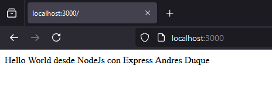

# Dental_Practice
 
Puebas Hellow World

##### Investigación de Requisitos o funcionalidades del software

##### Diseño de la Estructura de Datos (Ejemplo rapido de como definirla https://chatgpt.com/share/66ecc2cf-4748-8008-90c1-17cc33713db2)

##### Configuración del Entorno

##### Desarrollo del Backend

##### Creación de la Interfaz (HTML/CSS)

##### Integración Frontend y Backend

##### Pruebas y Corrección de Errores

##### Documentación del Proyecto

